# End-to-end Tests

This directory contains the end-to-end tests for `cdk-from-cfn`.

## Usage
To run the end-to-end tests, use these commands. For full details about how to
write new tests, update tests, and how the test workflow works, read the rest of
this document.

### Command examples
```sh
# run all end-to-end tests
cargo test --test end-to-end

# run one end-to-end test case in all languages
cargo test --test end-to-end simple

# run one end-to-end test case in one language
cargo test --test end-to-end simple::typescript

# run one end-to-end test case in one language, and monitor its output
cargo test --test end-to-end simple::typescript -- --nocapture
```

### Environment Variables

|                  | true                                                                                                                                                                                            | unset                                                                                                                                      |
| ---------------- | ----------------------------------------------------------------------------------------------------------------------------------------------------------------------------------------------- | ------------------------------------------------------------------------------------------------------------------------------------------ |
| CREATE_CFN_STACK | Create a CFN stack from the test's input `template.json` file at the beginning of the test execution.                                                                                                                               | Don't create a CFN stack.                                                                                                                  |
| UPDATE_SNAPSHOTS | Update all snapshot files if the test is successful. When this variable is set, the test does not compare it's output to whatever was previously stored in the snapshot. It just overwrites it. | Don't update snapshot files. This will not edit any files, and the test will fail if snapshots don't match, or if the App file is missing. |
| SKIP_CLEAN       | Do not delete any working directories where `cdk synth` was executed. For example `simple-typescript-working-dir/`.                                                                             | At the end of executing each test, delete it's working directory where `cdk synth` was executed.                                           |

## Glossary

A few key terms that can be easily confused.

- **[CloudFormation
  template](https://docs.aws.amazon.com/AWSCloudFormation/latest/UserGuide/cfn-whatis-concepts.html#cfn-concepts-templates)
  or CFN template**: refers to a file in JSON or YAML that defines a
  CloudFormation stack. Also, one of the outputs of `cdk synth`.
- **[CloudFormation
  stack](https://docs.aws.amazon.com/AWSCloudFormation/latest/UserGuide/cfn-whatis-concepts.html#cfn-concepts-stacks)
  or CFN stack**: refers to a collection of live AWS resources that can be
  managed together using CloudFormation. Think of it as an "instance" of a CFN
  template.
- **[CDK
  Stack](https://docs.aws.amazon.com/cdk/api/v2/docs/aws-cdk-lib.Stack.html)**:
  A Stack Construct defined in code in a high-level programming language. When
  an instance of this construct is synthesized in a CDK app, it produces a
  CloudFormation template (among other things).
- **cdk-from-cfn**: This tool which takes CFN templates as input, and produces
  CDK stacks.
- **cdk-from-cfn synthesize**: The step in the workflow of `cdk-from-cfn` that
  code generates a CDK stack in a target programming language (ex. typescript).
- **cdk synth**: A CDK CLI command that synthesizes a CDK application,
  generating a cloud assembly including CFN templates.

To put all of these terms into one sentence: **cdk-from-cfn** **synthesizes**
**CDK stacks** you can run **cdk synth** on to produce **CFN templates** which
define **CFN stacks**. 

*Note: These definitions are sufficient for this documentation, but are not
all-encompassing.*

## Test Capabilities
These tests cover:
1. Verify that CloudFormation templates are valid, by creating CloudFormation
   stacks from them.
2. Verify that CDK stack code generated by `cdk-from-cfn` actually works, by
   creating a CDK app and executing `cdk synth` on it.
3. Verify that the CloudFormation template produced by a CDK stack created by
   `cdk-from-cfn` is equivalent to the original CloudFormation template.

## How to add a new test

1. Create a folder under `tests/end-to-end/`. The name of this folder will be
   the name of the new test. Example: `tests/end-to-end/mytest/template.json`.

    *The name of the folder must be a valid Rust identifier.*
1. Save the CloudFormation template that will be the input for the test to a
   file at `tests/end-to-end/mytest/template.json`.
1. If the template you want to test relies on referencing resources that must
   already exist, also add a template that creates those dependency resources at
   `tests/end-to-end/mytest/create_first.json`. If this file is present, the
   tests will create a CloudFormation stack with this template, before
   attempting to create a CloudFormation stack with the template called
   `template.json`.
1. Add your test case to `tests/end-to-end.rs`, by editing the file manually.

    The file will contain a series of calls to the `test_case!` macro that will
    look something like this:
    ```rust
    test_case!(simple, "SimpleStack", &["golang"]);
    test_case!(vpc, "VpcStack");

    // Add new test cases here
    ```

    Add your new test above the comment that reads "Add new test cases here". 

    The `test_case!` macro takes 2 or 3 arguments:

      1. `$name:ident` - The name of the test module. This must be a valid Rust
         identifier. If you choose `mytest` as the identifier, you can run this
         test individually with the command `cargo test --test end-to-end
         mytest`.
      2. `$stack_name:literal` - The name of the CloudFormation stack, if the
         test environment is configured to create CloudFormation stacks for each
         test. And, the stack name passed to `cdk-from-cfn` that will be used to
         name the CDK stack construct definition.
      3. `$skip_cdk_synth:expr` - An array of languages that will be skipped
         when running CDK synth on the CDK code generated by cdk-from-cfn. The
         tests will still generate CDK code in all target languages, it is just
         the CDK synth part, and verification of the outputs of CDK synth that
         will be skipped.

    Now, the `tests/end-to-end.rs` file will look something like this:
    ```rust
    test_case!(simple, "SimpleStack", &["golang"]);
    test_case!(vpc, "VpcStack");
    test_case!(mytest, "MyStack");

    // Add new test cases here
    ```
1. Make sure the input CloudFormation template is a valid CloudFormation
   template.
    1. Set the `CREATE_CFN_STACK` environment variable to true.
        
        `export CREATE_CFN_STACK=true`

        This will tell the tests to use the Rust AWS SDK to create a
        CloudFormation stack from the test's input CloudFormation stack. Your
        shell will need to have AWS credentials available to create the
        CloudFormation stack for your test.

        To turn this off, run:

        `unset CREATE_CFN_STACK`

        You must use `unset` and not set the variable to 0 or false, because the
        logic used in the tests just checks for absence or presence of a value
        in this env variable.
    1. Run your test.
        
        `cargo test --test end-to-end mytest -- --nocapture`

        The `--nocapture` flag here allows you to monitor the progress of your
        test as it is running. It tells `cargo` to not capture the output of the
        test, and print it to stdout right away. Normal `cargo test` behavior is
        to only print stdout of a test if it fails.

        You will see a message indicating that creation of the CloudFormation
        stack was successful. Iterate on your template until is successful.

        After getting past this part, the test will fail on later parts of the
        workflow. Follow the next steps to resolve.

1. CDK app files

    Now that we know the input CloudFormation template is valid, we need an app
    file for each language
     
    set UPDATE_SNAPSHOTS=true run your test again

1. If needed, iterate until your test passes for all languages. You can run a
single test in a specific language. For example:

    ```sh
    cargo test --test end-to-end mytest::typescript
    ```

    If a test case does not successfully CDK synth in some languages, you can
    skip CDK synth in those languages by specifying that in your `test_case!()`
    call in end-to-end.rs. For example:
        
    ```rust
    test_case!(simple, "SimpleStack", &["golang"]);
    ```
    
1. Now that your test is passing, determine if this test case should be testing
   different combinations of Stack Construct props. If the input CloudFormation
   template had parameters, then `cdk-from-cfn` will generate a CDK stack with
   some custom Stack props. Update the CDK App files in your test's snapshot to
   test different values and combinations for these props. At this point, a
   default starting point of these App files have been generated for you at:

   - `tests/end-to-end/mytest/csharp/Program.cs`
   - `tests/end-to-end/mytest/golang/app.go`
   - `tests/end-to-end/mytest/java/src/main/java/com/myorg/MyApp.java`
   - `tests/end-to-end/mytest/python/app.py`
   - `tests/end-to-end/mytest/typescript/app.ts`

1. Review the test outputs for correctness.
    - CDK Stacks generated by `cdk-from-cfn`
        - `tests/end-to-end/mytest/csharp/Stack.cs`
        - `tests/end-to-end/mytest/golang/stack.go`
        - `tests/end-to-end/mytest/java/src/main/java/com/myorg/Stack.java`
        - `tests/end-to-end/mytest/python/stack.py`
        - `tests/end-to-end/mytest/typescript/stack.ts`
    - CloudFormation templates generated by `cdk synth`
        - `tests/end-to-end/mytest/<language>/Stack.template.json`
            - The name of this file may vary if you edited the App file to give
              the stack a different name.
    - The diff between the original CloudFormation template and the new
      CloudFormation template
        - `tests/end-to-end/mytest/<language>/Stack.diff`
            - The name of this file will match the template file, and may vary
              if you edited the App file to give the stack a different name.
            - If this file does not exist, that means the new stack is identical
              to the original stack. Hooray! You do not need to manually review
              to see if the changes are acceptable.
    
    Note: This diff mechanism should be improved so that this manual review is
    either not necessary, or to make it easier. See [issue](TODO add link).

1. To be sure your test will succeed in CI/CD, you can unset `CREATE_CFN_STACK`
    and UPDATE_SNAPSHOTS env variables, and run your tests again.

    ```
    unset CREATE_CFN_STACK
    unset UPDATE_SNAPSHOTS

    cargo test --test end-to-end mytest
    ```

## How to update a test

In these steps, assume you are updating a test called "simple".

1. After making changes to any of the following, you may need to update the end
   to end tests.
    - Source code in `cdk-from-cfn/src`
    - The test module `end-to-end.rs`
    - A test's CloudFormation templates: `template.json` or `create-first.json`
    - A test's CDK app files: `App.ts`, `app.py`, etc.

1. First, set your environment to mimic CI/CD and run the tests after your
   changes.
    ```sh
    unset UPDATE_SNAPSHOTS
    unset CREATE_CFN_STACK
    cargo test --test end-to-end
    ```
    If you changed a test, something should fail here. If you made source code
    changes, and we have good test coverage, some test should probably fail as
    well. If it doesn't, add a new test!
1. If the input CloudFormation templates changed, make sure they are valid. Do
   step 5 from [How to add a new test](#how-to-add-a-new-test).
1. Set `UPDATE_SNAPSHOTS=true` and run your test.
    ```bash
    UPDATE_SNAPSHOTS=true
    cargo test --test end-to-end simple
    ```
1. If needed, iterate on failing tests until they succeed.

    For example:
    ```bash
    cargo test --test end-to-end simple::java -- --nocapture
    ```

    The `--nocapture` flag here allows you to monitor the progress of the test
    as it is running. It tells `cargo` to not capture the output of the test,
    and print it to stdout right away.

1. Finally, review the files that have changed using git. Files that may change:
    - `simple/typescript/Stack.ts`
        - Changes to this file indicate that `cdk-from-cfn` is now producing
          different CDK code than before. Is this expected? Did code generation
          logic change? Or, did the input `template.json` change?
    - `simple/typescript/Stack.template.json`
        - Changes to this file would be expected if the input `template.json`,
          the way `cdk-from-cfn` generates CDK code, or the way CDK synthesizes
          CFN templates changes. 
    - `simple/typescript/Stack.diff`
        - Changes to this file mean that the difference between the original CFN
          template, and the CFN template generated by a CDK stack generated by
          cdk-from-cfn has changed. Review this file to make sure that the new
          CFN template would still be considered equivalent to the original CFN
          template.
    - ... etc for all languages.

## Layout of this directory


Below is a subset of the file in this repo, to demonstrate how the files are
organized for the end-to-end tests.

```
cdk-from-cfn
├── src
└── tests
    ├── end-to-end.rs
    └── end-to-end
        ├── README.md
        ├── app-boilerplate-files
        │   ├── csharp
        │   │   ├── CSharp.csproj
        │   │   └── setup-and-synth.sh
        │   ├── golang
        │   │   ├── go.mod
        │   │   ├── go.sum
        │   │   └── setup-and-synth.sh
        │   ├── java
        │   │   ├── pom.xml
        │   │   └── setup-and-synth.sh
        │   ├── python
        │   │   ├── requirements.txt
        │   │   └── setup-and-synth.sh
        │   └── typescript
        │       ├── package.json
        │       └── setup-and-synth.sh
        ├── simple
        │   ├── template.json
	 	│   │   ├── create_first.json
        │   ├── csharp
        │   │   ├── Program.cs
        │   │   ├── Stack.cs
        │   │   ├── Stack.diff
        │   │   └── Stack.template.json
        │   ├── golang
        │   │   └── stack.go
        │   ├── java
        │   │   ├── src/java/com/myorg
        │   │   │   ├── MyApp.java
        │   │   │   └── Stack.java
        │   │   ├── Stack.diff
        │   │   └── Stack.template.json
        │   ├── python
        │   │   ├── app.py
        │   │   ├── stack.py
        │   │   ├── Stack.diff
        │   │   └── Stack.template.json
        │   └── typescript
        │       ├── app.ts
        │       ├── stack.ts
        │       ├── Stack.diff
        │       └── Stack.template.json
	    ├── simple-csharp-working-dir/                  
	    ├── simple-java-working-dir/             
		├── simple-python-working-dir/           
		├── simple-typescript-working-dir/
	    ├── vpc/
		└── ... // more test cases
```

The `cdk-from-cfn/tests/end-to-end.rs` Rust module contains the source code for
the end to end tests, and then the `cdk-from-cfn/tests/end-to-end/` contains all
end to end test cases, and all the files needed to run the tests.

The `app-boilerplate-files/` directory has a directory for each language, which
contains any files necessary to run a CDK app in that language. It also contains
a script called `setup-and-synth.sh` which runs any setup commands like `npm
install` that are specific to the language, and then runs the `cdk synth`
command with an `--app` argument specific to that language. Files from this
directory will be copied into each test's working directory while the test is
running prior to executing `cdk synth` on that test.

Then `simple/` is a folder for one test case. Each test case has its own folder.
It has the input CloudFormation template, `template.json`, and then optionally a
CloudFormation template defining resources that the main one depends on,
`create-first.json`. It contains a folder for each language, where the output of
the test in that language is stored. The stack definition files (`stack.ts,
Stack.java`, etc.) are generated by `cdk-from-cfn`. The app definition files
(`app.ts`, `MyApp.java`, etc) have a default version that is generated by the
tests, but these can be modified by hand to test a variety of stack parameter
combinations. The `Stack.template.json` files are the CloudFormation templates
created by running `cdk synth` on the CDK app. If there are multiple stacks
defined in the app file, then there will be multiple `Stack.template.json`
files.

There are directories called `<testname>-<language>-working-dir` for each test
case and language combination. These folders are ephemeral, ignored by git, only
exist during test execution, and are created and deleted by the tests. They are
used to execute `cdk synth` in.


## Workflow Design: What happens when you run the tests?

```mermaid
---
title: End to End Tests Workflow Diagram
---
flowchart TB
    if-create-stack{"`1\. if CREATE_CFN_STACK`"}
    create-cfn-stack{"`2\. create CFN stack`"}
    exec-cdk-from-cfn{"`3\. execute cdk-from-cfn`"}
    if-update-snapshot-1{"`4\. if UPDATE_SNAPSHOTS`"}
    cdk-stack-def-snapshot-exists{"`5\. does CDK stack snapshot exist?`"}
    assert-actual-cdk-stack-def-eq-expected{"`6\. assert actual CDK stack equals expected CDK stack from snapshot`"}
    if-skip-cdk-synth{"`7\. if test is configured to skip cdk synth`"}
    if-update-snapshot-2{"`8\. if UPDATE_SNAPSHOTS`"}
    save-cdk-stack-def-to-snapshot-1["`9\. save CDK stack to snapshot`"]
    create-test-working-dir["`10\. create test working directory`"]
    cdk-app-file-exists{"`11\. does snapshot have a CDK App file?`"}
    copy-app-file-to-working-dir["`12\. copy App file to working directory`"]
    if-update-snapshot-3{"`13\. if UPDATE_SNAPSHOTS`"}
    generate-default-app-file-in-working-dir["`14\. generate default App file in working directory`"]
    copy-language-boilerplate-files-to-working-dir["`15\. copy language boilerplate files to working directory`"]
    save-cdk-stack-def-to-working-dir["`16\. save CDK stack to a file in working directory`"]
    exec-cdk-synth{"`17\. execute cdk synth`"}
    diff-new-cfn-templates-with-original["`18\. find the diff between new CFN template generated by cdk synth and the original CFN template`"]
    if-update-snapshot-4{"`19\. if UPDATE_SNAPSHOTS`"}
    save-cdk-stack-def-to-snapshot-2["`20\. save CDK stack to snapshot`"]
    actual-diff-is-empty-1{"`21\. is the actual diff file empty?`"}
    save-diff-and-template-to-snapshots["`22\. save diff file and template file to snapshot`"]
    delete-existing-diff-and-template["`23\. delete template and diff file from snapshot, if they exist`"]
    diff-and-template-snapshots-exists{"`24\. does snapshot contain diff and template file?`"}
    assert-actual-diff-and-template-eq-expected{"`25\. assert actual diff and template files match expected from snapshot`"}
    actual-diff-is-empty-2{"`26\. is the actual diff file empty?`"}
    test-failed-1["`❌ test failed ❌`"]
    test-failed-2["`❌ test failed ❌`"]
    test-failed-3["`❌ test failed ❌`"]
    test-failed-4["`❌ test failed ❌`"]
    test-failed-5["`❌ test failed ❌`"]
    test-failed-6["`❌ test failed ❌`"]
    test-failed-7["`❌ test failed ❌`"]
    test-failed-8["`❌ test failed ❌`"]
    test-passed-1["`✅ test passed ✅`"]
    test-passed-2["`✅ test passed ✅`"]
    test-passed-3["`✅ test passed ✅`"]
    test-passed-4["`✅ test passed ✅`"]

    create-cfn-stack -->|fails| test-failed-1
    if-create-stack -->|true| create-cfn-stack -->|succeeds| exec-cdk-from-cfn -->|succeeds| if-update-snapshot-1 -->|true| if-skip-cdk-synth -->|true| if-update-snapshot-2 -->|true| save-cdk-stack-def-to-snapshot-1 --> test-passed-1
    if-update-snapshot-2 -->|false| test-passed-1
    if-create-stack -->|false| exec-cdk-from-cfn -->|fails| test-failed-2
    
    if-update-snapshot-1 -->|false| cdk-stack-def-snapshot-exists -->|yes| assert-actual-cdk-stack-def-eq-expected -->|succeeds| if-skip-cdk-synth -->|false| create-test-working-dir --> cdk-app-file-exists -->|yes| copy-app-file-to-working-dir --> copy-language-boilerplate-files-to-working-dir --> save-cdk-stack-def-to-working-dir --> exec-cdk-synth -->|succeeds| diff-new-cfn-templates-with-original --> if-update-snapshot-4 -->|true| save-cdk-stack-def-to-snapshot-2 --> actual-diff-is-empty-1 -->|no| save-diff-and-template-to-snapshots --> test-passed-2
    
    cdk-app-file-exists -->|no| if-update-snapshot-3 -->|true| generate-default-app-file-in-working-dir --> copy-language-boilerplate-files-to-working-dir
    if-update-snapshot-3 -->|false| test-failed-3
    assert-actual-cdk-stack-def-eq-expected -->|fails| test-failed-4
    cdk-stack-def-snapshot-exists -->|no| test-failed-5

    exec-cdk-synth -->|fails| test-failed-6
    if-update-snapshot-4 -->|false| diff-and-template-snapshots-exists -->|yes| assert-actual-diff-and-template-eq-expected -->|succeeds| test-passed-4
    diff-and-template-snapshots-exists -->|no| actual-diff-is-empty-2 -->|yes| test-passed-3
    actual-diff-is-empty-2 -->|no| test-failed-7
    assert-actual-diff-and-template-eq-expected -->|fails| test-failed-8
    actual-diff-is-empty-1 -->|yes| delete-existing-diff-and-template --> test-passed-2

```




These steps are executed for each test, and in each language. In the
descriptions below, assume we are running a test called "simple" in TypeScript.
All paths in the descriptions below are relative to
`cdk-from-cfn/tests/end-to-end`.

1. Check if the environment variable `CREATE_CFN_STACK` is set. This should
   always be false when running in CI/CD, but can be set to true for local
   development.
2. Create a CFN stack from `simple/template.json` CFN template file using the
   AWS SDK for Rust. This step requires your environment to have AWS
   credentials.
3. Execute `cdk-from-cfn` to synthesize a CDK stack from the input CFN template.
4. Check if the environment variable `UPDATE_SNAPSHOTS` is set. This should
   always be false when running in CI/CD, because it causes modification of the
   test files. This should be used for local development when creating new
   tests, or updating existing tests.
5. Check if there is a CDK stack in the snapshot for this test. This file would
   be located at `tests/end-to-end/simple/typescript/Stack.ts`. If the snapshot
   does not exist, that probably means this is new test, and the test fails with
   a message telling the developer to set `UPDATE_SNAPSHOTS=true`, so that the
   test can save the output of the test execution as the snapshot.  (*All test
   snapshot or output files are zipped into an archive called
   `end-to-end-test-snapshots.zip` during build time, which is then included in
   the test binary. This is an implementation detail. Always work with the files
   in their test directory at `tests/end-to-end/simple/`*)
6. Assert that the CDK stack produced by running `cdk-from-cfn` matches the
   expected code in `simple/typescript/Stack.ts`.
7. Check if the test has been configured to skip `cdk synth`. This is an option
   so that we can have test cases that work in some languages, but don't yet
   work in others. If a test is set to skip `cdk synth`, that indicates there is
   a bug or a coverage gap.
8. Check if `UPDATE_SNAPSHOTS` is true.
9. Save the CDK stack produced by this test run to the snapshot file location:
   `simple/typescript/Stack.ts`.
10. Create a working directory for the test:
    `tests/end-to-end/simple-typescript-working-dir/`. This will be used to
    create a fully working CDK app.
11. Check if there is a CDK app file in the snapshot for this test. This file
    would be located at `tests/end-to-end/simple/typescript/App.ts`.
12. If the app file already exists, copy it to the working directory.
13. If there is no app file, check if `UPDATE_SNAPSHOTS` is true before creating
    one. If `UPDATE_SNAPSHOTS` is false, the test will fail. As a general rule,
    the test will only modify files if `UPDATE_SNAPSHOTS` is true.
14. Generate a default app file that instantiates an app with one stack. The
    stack is initialized with no construct props, meaning default values will be
    used. Each language has specific code to generate the app file, check out
    the implementation [here](../cdk_app_code_writers.rs). This step ends up
    only running for a new test. When the test completes successfully, the
    generated app file will be saved into the snapshot at
    `tests/end-to-end/simple/typescript/App.ts`. In future iterations, it can be
    modified by hand to test different stack input props, and the test will not
    overwrite it. 
15. Copy all files from `app-boilerplate-files/typescript/` to the working
    directory `simple-typescript-working-dir/`. These are the files necessary
    for a fully working CDK app.
16. Save the CDK stack created by running `cdk-from-cfn` during this test to
    `simple-typescript-working-dir/Stack.ts`.
17. Execute `cdk synth`. This is done by shelling out to run the
    `setup-and-synth.sh` script. The script is authored at
    `app-boilerplate-files/setup-and-synth.sh`, but is executed from the
    temporary working directory during the test at
    `simple-typescript-working-dir/setup-and-synth.sh`.
18. Find the difference between the new CFN template generated by `cdk synth`
    found in `tests/end-to-end/simple-typescript-working-dir/cdk.out/` and the
    original CFN template at `tests/end-to-end/simple/template.json`. The
    mechanism currently used for this is a basic `git diff` of the two files.
    This should be improved to do a comparison of the actual json objects in
    those files, see [this issue](). Depending on the contents of
    `simple/typescript/App.ts`, there may be multiple CFN templates created by
    `cdk synth`. If there are multiple, this step will diff all of them compared
    to the one original CFN template, and the following steps will be applied to
    all CFN templates.
19. Check if `UPDATE_SNAPSHOTS` is true.
20. Save the CDK stack to the snapshot at
    `tests/end-to-end/simple/typescript/Stack.ts`
21. Check if the diff file produced by step 18 is empty.
22. Save the diff file and template file to the snapshot at
    `tests/end-to-end/simple/typescript/Stack.diff` and
    `tests/end-to-end/simple/typescript/Stack.template.json`. These files are
    both called `Stack` because that is the name for the stack in the default
    app file created in step 14. The diff file is saved, and the test is not
    automatically failed here, because the original template file may look
    different from the one created by `cdk synth` but it might be equivalent
    when creating a CFN stack from it.
23. If the diff file is empty, there is no point to save it in the snapshot.
    And, no reason to save the template file either, because it is identical to
    the original template file. If there was previously a diff and template file
    from an earlier version of this test, then delete them.
24. Check if the diff and template files exist in the snapshot at
    `tests/end-to-end/simple/typescript/Stack.diff` and
    `tests/end-to-end/typescript/Stack.template.json`.
25. Assert that the actual diff and template files match the expected from the
    snapshot. 
    - `tests/end-to-end/simple-typescript-working-dir/Stack.diff` ==
      `test/end-to-end/simple/typescript/Stack.diff`
    - `tests/end-to-end/simple-typescript-working-dir/cdk.out/Stack.template.json`
      == `test/end-to-end/simple/typescript/Stack.template.json`
26. If there is no diff and template file saved in the snapshot, check if the
    actual diff file is empty. If
    `test/end-to-end/simple-typescript-working-dir/Stack.diff` is empty, then it
    is expected that there is no diff and template file saved in the snapshot,
    so the test passes. As mentioned in step 22, there is no point to save the
    diff or template when the diff is empty.