# End-to-End Tests

This directory contains the end-to-end tests for `cdk-from-cfn`.

TODO high level description of the tests, and what they are capable of
verifying.

## Glossary

A few key terms that can be easily confused.

- **[CloudFormation template](https://docs.aws.amazon.com/AWSCloudFormation/latest/UserGuide/cfn-whatis-concepts.html#cfn-concepts-templates) or CFN template**: refers to a file in JSON or YAML that defines a CloudFormation stack. Also, one of the outputs of `cdk synth`.
- **[CloudFormation stack](https://docs.aws.amazon.com/AWSCloudFormation/latest/UserGuide/cfn-whatis-concepts.html#cfn-concepts-stacks) or CFN stack**: refers to a collection of live AWS resources that can be managed together using CloudFormation. Think of it as an "instance" of a CFN template.
- **[CDK Stack](https://docs.aws.amazon.com/cdk/api/v2/docs/aws-cdk-lib.Stack.html)**: A Stack Construct defined in code in a high-level programming language. When an instance of this construct is synthesized in a CDK app, it produces a CloudFormation template (among other things).
- **cdk-from-cfn**: This tool which takes CFN templates as input, and produces CDK stacks.
- **cdk-from-cfn synthesize**: The step in the workflow of `cdk-from-cfn` that code generates a CDK stack in a target programming language (ex. typescript).
- **cdk synth**: A CDK CLI command that synthesizes a CDK application, generating a cloud assembly including CFN templates.

To put all of these terms into one sentence: **cdk-from-cfn** **synthesizes** **CDK stacks** you can run **cdk synth** on to produce **CFN templates** which define **CFN stacks**. 

*Note: These definitions are sufficient for this documentation, but are not all-encompassing.*


## How to add a new test

1. Create a folder under `tests/end-to-end/`. The name of this folder will be
   the name of the new test. Example: `tests/end-to-end/mytest/template.json`.

    *The name of the folder must be a valid Rust identifier.*
1. Save the CloudFormation template that will be the input for the test to a
   file at `tests/end-to-end/mytest/template.json`.
1. If the template you want to test relies on referencing resources that must
   already exist, also add a template that creates those dependency resources at
   `tests/end-to-end/mytest/create_first.json`. If this file is present, the
   tests will create a CloudFormation stack with this template, before
   attempting to create a CloudFormation stack with the template called
   `template.json`.
1. Add your test case to `tests/end-to-end.rs`, by editing the file manually.

    The file will contain a series of calls to the `test_case!` macro that will
    look something like this:
    ```rust
    test_case!(simple, "SimpleStack", &["golang"]);
    test_case!(vpc, "VpcStack");

    // Add new test cases here
    ```

    Add your new test above the comment that reads "Add new test cases here". 

    The `test_case!` macro takes 2 or 3 arguments:

      1. `$name:ident` - The name of the test module. This must be a valid Rust
         identifier. If you choose `mytest` as the identifier, you can run this
         test individually with the command `cargo test --test end-to-end
         mytest`.
      2. `$stack_name:literal` - The name of the CloudFormation stack, if the
         test environment is configured to create CloudFormation stacks for each
         test. And, the stack name passed to `cdk-from-cfn` that will be used to
         name the CDK stack construct definition.
      3. `$skip_cdk_synth:expr` - An array of languages that will be skipped
         when running CDK synth on the CDK code generated by cdk-from-cfn. The
         tests will still generate CDK code in all target languages, it is just
         the CDK synth part, and verification of the outputs of CDK synth that
         will be skipped.

    Now, the `tests/end-to-end.rs` file will look something like this:
    ```rust
    test_case!(simple, "SimpleStack", &["golang"]);
    test_case!(vpc, "VpcStack");
    test_case!(mytest, "MyStack");

    // Add new test cases here
    ```
1. Make sure the input CloudFormation template is a valid CloudFormation
   template.
    1. Set the `CREATE_CFN_STACK` environment variable to true.
        
        `export CREATE_CFN_STACK=true`

        This will tell the tests to use the Rust AWS SDK to create a
        CloudFormation stack from the test's input CloudFormation stack. Your
        shell will need to have AWS credentials available to create the
        CloudFormation stack for your test.

        To turn this off, run:

        `unset CREATE_CFN_STACK`

        You must use `unset` and not set the variable to 0 or false, because the
        logic used in the tests just checks for absence or presence of a value
        in this env variable.
    1. Run your test.
        
        `cargo test --test end-to-end mytest -- --nocapture`

        The `--nocapture` flag here allows you to monitor the progress of your
        test as it is running. It tells `cargo` to not capture the output of the
        test, and print it to stdout right away. Normal `cargo test` behavior is
        to only print stdout of a test if it fails.

        You will see a message indicating that creation of the CloudFormation
        stack was successful. Iterate on your template until is successful.

        After getting past this part, the test will fail on later parts of the
        workflow. Follow the next steps to resolve.

1. CDK app files

    Now that we know the input CloudFormation template is valid, we need an app
    file for each language
     
    set UPDATE_SNAPSHOTS=true run your test again

1. If needed, iterate until your test passes for all languages. ∫ You can run a
single test in a specific language. For example:

`cargo test --test end-to-end mytest::typescript`

If a test case does not successfully CDK synth in some languages, you can skip
CDK synth in those languages by specifying that in your `test_case!()` call in
end-to-end.rs. For example:
    
    `test_case!(simple, "SimpleStack", &["golang"]);`
    
8. Update the CDK App files to test different parameter combinations

9. Review the test outputs

10. Unset CREATE_CFN_STACK and UPDATE_SNAPSHOTS env variables, and run your tests
    again to make sure they will pass in CI.


SKIP clean


## How to update a test


## Layout of this directory


created with: tree . -C -H cdk-from-cfn --gitignore

Below is a subset of the file in this repo, to demonstrate how the files are
organized for the end-to-end tests.

```
cdk-from-cfn
├── src
└── tests
    ├── end-to-end.rs
    └── end-to-end
        ├── README.md
        ├── app-boilerplate-files
        │   ├── csharp
        │   │   ├── CSharp.csproj
        │   │   └── setup-and-synth.sh
        │   ├── golang
        │   │   ├── go.mod
        │   │   ├── go.sum
        │   │   └── setup-and-synth.sh
        │   ├── java
        │   │   ├── pom.xml
        │   │   └── setup-and-synth.sh
        │   ├── python
        │   │   ├── requirements.txt
        │   │   └── setup-and-synth.sh
        │   └── typescript
        │       ├── package.json
        │       └── setup-and-synth.sh
        ├── simple
        │   ├── template.json
	 	│   │   ├── create_first.json
        │   ├── csharp
        │   │   ├── Program.cs
        │   │   ├── Stack.cs
        │   │   ├── Stack.diff
        │   │   └── Stack.template.json
        │   ├── golang
        │   │   └── stack.go
        │   ├── java
        │   │   ├── src/java/com/myorg
        │   │   │   ├── MyApp.java
        │   │   │   └── Stack.java
        │   │   ├── Stack.diff
        │   │   └── Stack.template.json
        │   ├── python
        │   │   ├── app.py
        │   │   ├── stack.py
        │   │   ├── Stack.diff
        │   │   └── Stack.template.json
        │   └── typescript
        │       ├── app.ts
        │       ├── stack.ts
        │       ├── Stack.diff
        │       └── Stack.template.json
	    ├── simple-csharp-working-dir/                  
	    ├── simple-java-working-dir/             
		├── simple-python-working-dir/           
		├── simple-typescript-working-dir/
	    ├── vpc/
		└── ... // more test cases
```

The `cdk-from-cfn/tests/end-to-end.rs` Rust module contains the source code for
the end to end tests, and then the `cdk-from-cfn/tests/end-to-end/` contains all
end to end test cases, and all the files needed to run the tests.

The `app-boilerplate-files/` directory has a directory for each language, which
contains any files necessary to run a CDK app in that language. It also contains
a script called `setup-and-synth.sh` which runs any setup commands like `npm
install` that are specific to the language, and then runs the `cdk synth`
command with an `--app` argument specific to that language. Files from this
directory will be copied into each test's working directory while the test is
running prior to executing `cdk synth` on that test.

Then `simple/` is a folder for one test case. Each test case has its own folder.
It has the input CloudFormation template, `template.json`, and then optionally a
CloudFormation template defining resources that the main one depends on,
`create-first.json`. It contains a folder for each language, where the output of
the test in that language is stored. The stack definition files (`stack.ts,
Stack.java`, etc.) are generated by `cdk-from-cfn`. The app definition files
(`app.ts`, `MyApp.java`, etc) have a default version that is generated by the
tests, but these can be modified by hand to test a variety of stack parameter
combinations. The `Stack.template.json` files are the CloudFormation templates
created by running `cdk synth` on the CDK app. If there are multiple stacks
defined in the app file, then there will be multiple `Stack.template.json`
files.

There are directories called `<testname>-<language>-working-dir` for each test
case and language combination. These folders are ephemeral, ignored by git, only
exist during test execution, and are created and deleted by the tests. They are
used to execute `cdk synth` in.


## Workflow Design: What happens when you run the tests?

```mermaid
---
title: End to End Tests Workflow Diagram
---
flowchart TB
    if-create-stack{"`1\. if CREATE_CFN_STACK`"}
    create-cfn-stack{"`2\. create CFN stack`"}
    exec-cdk-from-cfn{"`3\. execute cdk-from-cfn`"}
    if-update-snapshot-1{"`4\. if UPDATE_SNAPSHOTS`"}
    if-update-snapshot-2{"`8\. if UPDATE_SNAPSHOTS`"}
    if-update-snapshot-3{"`18\. if UPDATE_SNAPSHOTS`"}
    cdk-stack-def-snapshot-exists{"`5\. does CDK stack snapshot exist?`"}
    assert-actual-cdk-stack-def-eq-expected{"`6\. assert actual CDK stack equals expected CDK stack from snapshot`"}
    if-skip-cdk-synth{"`7\. if test is configured to skip cdk synth`"}
    save-cdk-stack-def-to-snapshot-1["`9\. save CDK stack to snapshot`"]
    save-cdk-stack-def-to-snapshot-2["`20\. save CDK stack to snapshot`"]
    create-test-working-dir["`10\. create test working directory`"]
    if-cdk-app-file-exists{"`11\. does snapshot have a CDK App file?`"}
    copy-app-file-to-working-dir["`12\. copy App file to working directory`"]
    generate-default-app-file-in-working-dir["`13\. generate default App file in working directory`"]
    copy-language-boilerplate-files-to-working-dir["`14\. copy language boilerplate files to working directory`"]
    save-cdk-stack-def-to-working-dir["`15\. save CDK stack to a file in working directory`"]
    exec-cdk-synth{"`16\. execute cdk synth`"}
    diff-new-cfn-templates-with-original["`17\. find the diff between new CFN template generated by cdk synth and the original CFN template`"]
    save-diffs-and-templates-to-snapshots["`19\. save diff file and template file to snapshot`"]
    if-diff-and-template-snapshots-exists{"`21\. does snapshot contain diff and template file?`"}
    assert-actual-diffs-and-templates-eq-expected{"`22\. assert actual diff and template files match expected from snapshot`"}
    actual-diff-is-empty{"`23\. is the actual diff file empty?`"}
    test-failed-1["`❌ test failed ❌`"]
    test-failed-2["`❌ test failed ❌`"]
    test-failed-3["`❌ test failed ❌`"]
    test-failed-4["`❌ test failed ❌`"]
    test-failed-5["`❌ test failed ❌`"]
    test-failed-6["`❌ test failed ❌`"]
    test-failed-7["`❌ test failed ❌`"]
    test-passed-1["`✅ test passed ✅`"]
    test-passed-2["`✅ test passed ✅`"]
    test-passed-3["`✅ test passed ✅`"]
    test-passed-4["`✅ test passed ✅`"]

    create-cfn-stack -->|fails| test-failed-1
    if-create-stack -->|yes| create-cfn-stack -->|succeeds| exec-cdk-from-cfn -->|succeeds| if-update-snapshot-1 -->|yes| if-skip-cdk-synth -->|yes| if-update-snapshot-2 -->|yes| save-cdk-stack-def-to-snapshot-1 --> test-passed-1
    if-update-snapshot-2 -->|no| test-passed-1
    if-create-stack -->|no| exec-cdk-from-cfn -->|fails| test-failed-2
    
    if-update-snapshot-1 -->|no| cdk-stack-def-snapshot-exists -->|yes| assert-actual-cdk-stack-def-eq-expected -->|succeeds| if-skip-cdk-synth -->|no| create-test-working-dir --> if-cdk-app-file-exists -->|yes| copy-app-file-to-working-dir --> copy-language-boilerplate-files-to-working-dir --> save-cdk-stack-def-to-working-dir --> exec-cdk-synth -->|succeeds| diff-new-cfn-templates-with-original --> if-update-snapshot-3 -->|yes| save-diffs-and-templates-to-snapshots --> save-cdk-stack-def-to-snapshot-2 --> test-passed-2
    
    if-cdk-app-file-exists -->|no| generate-default-app-file-in-working-dir
    assert-actual-cdk-stack-def-eq-expected -->|fails| test-failed-4
    cdk-stack-def-snapshot-exists -->|no| test-failed-3

    exec-cdk-synth -->|fails| test-failed-5
    if-update-snapshot-3 -->|no| if-diff-and-template-snapshots-exists -->|yes| assert-actual-diffs-and-templates-eq-expected -->|succeeds| test-passed-4
    if-diff-and-template-snapshots-exists -->|no| actual-diff-is-empty -->|yes| test-passed-3
    actual-diff-is-empty -->|no| test-failed-6
    assert-actual-diffs-and-templates-eq-expected -->|fails| test-failed-7

```




These steps are executed for each test, and in each language.

15. This is the CDK stack produced by the current test's execution of cdk-from-cfn.

23.  - there is no difference between CFN template generated by cdk synth and original CFN template


  

      