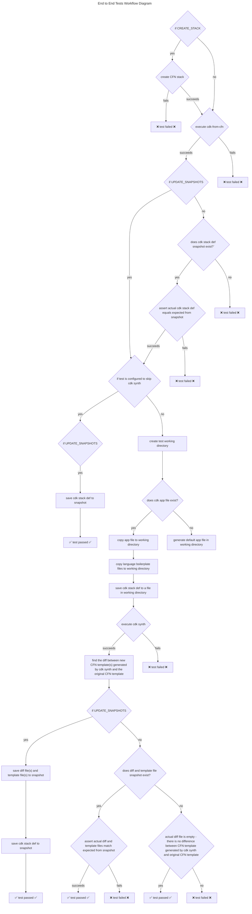

```mermaid
---
title: End to End Tests Workflow Diagram
---
flowchart TB
    if-create-stack{"`if CREATE_STACK`"}
    create-cfn-stack{"`create CFN stack`"}
    exec-cdk-from-cfn{"`execute cdk-from-cfn`"}
    if-update-snapshot-1{"`if UPDATE_SNAPSHOTS`"}
    if-update-snapshot-2{"`if UPDATE_SNAPSHOTS`"}
    if-update-snapshot-3{"`if UPDATE_SNAPSHOTS`"}
    cdk-stack-def-snapshot-exists{"`does cdk stack def snapshot exist?`"`}
    assert-actual-cdk-stack-def-eq-expected{"`assert actual cdk stack def equals expected from snapshot`"}
    if-skip-cdk-synth{"`if test is configured to skip cdk synth`"}
    save-cdk-stack-def-to-snapshot-1["`save cdk stack def to snapshot`"]
    save-cdk-stack-def-to-snapshot-2["`save cdk stack def to snapshot`"]
    create-test-working-dir["`create test working directory`"]
    if-cdk-app-file-exists{"`does cdk app file exist? `"}
    copy-app-file-to-working-dir["`copy app file to working directory`"]
    generate-default-app-file-in-working-dir["`generate default app file in working directory`"]
    copy-language-boilerplate-files-to-working-dir["`copy language boilerplate files to working directory`"]
    save-cdk-stack-def-to-working-dir["`save cdk stack def to a file in working directory`"]
    exec-cdk-synth{"`execute cdk synth`"}
    diff-new-cfn-templates-with-original["`find the diff between new CFN template(s) generated by cdk synth and the original CFN template`"]
    save-diffs-and-templates-to-snapshots["`save diff file(s) and template file(s) to snapshot`"]
    if-diff-and-template-snapshots-exists{"`does diff and template file snapshot exist?`"}
    assert-actual-diffs-and-templates-eq-expected{"`assert actual diff and template files match expected from snapshot`"}
    actual-diff-is-empty{"`actual diff file is empty - there is no difference between CFN template generated by cdk synth and original CFN template`"}
    test-failed-1["`❌ test failed ❌`"]
    test-failed-2["`❌ test failed ❌`"]
    test-failed-3["`❌ test failed ❌`"]
    test-failed-4["`❌ test failed ❌`"]
    test-failed-5["`❌ test failed ❌`"]
    test-failed-6["`❌ test failed ❌`"]
    test-failed-7["`❌ test failed ❌`"]
    test-passed-1["`✅ test passed ✅`"]
    test-passed-2["`✅ test passed ✅`"]
    test-passed-3["`✅ test passed ✅`"]
    test-passed-4["`✅ test passed ✅`"]

    create-cfn-stack -->|fails| test-failed-1
    if-create-stack -->|yes| create-cfn-stack -->|succeeds| exec-cdk-from-cfn -->|succeeds| if-update-snapshot-1 -->|yes| if-skip-cdk-synth -->|yes| if-update-snapshot-2 -->|yes| save-cdk-stack-def-to-snapshot-1 --> test-passed-1
    if-create-stack -->|no| exec-cdk-from-cfn -->|fails| test-failed-2
    
    if-update-snapshot-1 -->|no| cdk-stack-def-snapshot-exists -->|yes| assert-actual-cdk-stack-def-eq-expected -->|succeeds| if-skip-cdk-synth -->|no| create-test-working-dir --> if-cdk-app-file-exists -->|yes| copy-app-file-to-working-dir --> copy-language-boilerplate-files-to-working-dir --> save-cdk-stack-def-to-working-dir --> exec-cdk-synth -->|succeeds| diff-new-cfn-templates-with-original --> if-update-snapshot-3 -->|yes| save-diffs-and-templates-to-snapshots --> save-cdk-stack-def-to-snapshot-2 --> test-passed-2
    
    if-cdk-app-file-exists -->|no| generate-default-app-file-in-working-dir
    assert-actual-cdk-stack-def-eq-expected -->|fails| test-failed-4
    cdk-stack-def-snapshot-exists -->|no| test-failed-3

    exec-cdk-synth -->|fails| test-failed-5
    if-update-snapshot-3 -->|no| if-diff-and-template-snapshots-exists -->|yes| assert-actual-diffs-and-templates-eq-expected -->|succeeds| test-passed-4
    if-diff-and-template-snapshots-exists -->|no| actual-diff-is-empty -->|yes| test-passed-3
    actual-diff-is-empty -->|no| test-failed-6
    assert-actual-diffs-and-templates-eq-expected -->|fails| test-failed-7

```